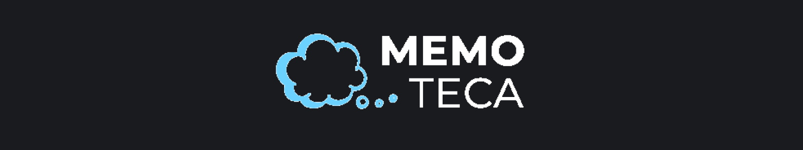
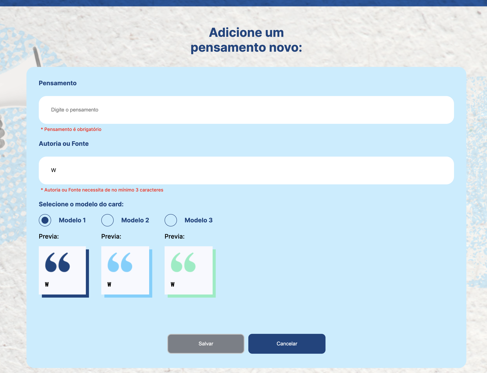
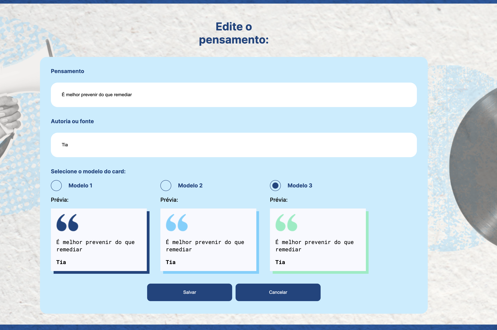

<div >
  
</div>

<p align="center">
	<a href="https://www.linkedin.com/in/wesley-andrade/">	
		
	</a>
	<a href="https://choosealicense.com/licenses/mit/">	
		
	</a>
</p>

<p align="center">
  <a href="#project">Project</a>&nbsp;&nbsp;&nbsp;|&nbsp;&nbsp;&nbsp;
  <a href="#layout">Layout</a>&nbsp;&nbsp;&nbsp;|&nbsp;&nbsp;&nbsp;
  <a href="#technologies">Technologies</a>&nbsp;&nbsp;&nbsp;|&nbsp;&nbsp;&nbsp;
  <a href="#installation">Installation</a>&nbsp;&nbsp;&nbsp;|&nbsp;&nbsp;&nbsp;
  <a href="#page_with_curl-license">License</a>
</p>

## Project

A Memoteca é um projeto concebido pela  <a href="https://www.alura.com.br/"> **Alura** </a> com o objetivo de desenvolver uma página web utilizando Angular que seja uma biblioteca de pensamentos e reflexões para nunca esquecer.

Assuntos abordados:

- [x] Estrutura de um componente em Angular
- [x] Property binding, interpolação, event binding e two-way data binding
- [x] Principais diretivas do Angular
- [x] Navegação dinâmica entre componentes através das rotas
- [x] Injeção de dependências
- [x] Requisições HTTP, CRUD e HttpParams
- [x] Formulários reativos e validações
- [x] Funcionalidade de busca
- [x] Paginação aos dados

## Layout

<div style="display: flex; flex-direction: 'row'; align-items: 'center';">
	
  
  
  
  
  
  
</div>

## Technologies

- [Angular](https://angular.io/)
- [json-server](https://github.com/typicode/json-server)
  
## Installation

#### Clone the Repository
```bash
git clone https://github.com/WesleyReboucas/memoteca.git
cd memoteca/
npm i
```

#### Server
```bash
cd memoteca/server
npm start
```

#### Project
```bash
cd memoteca/
npm start
```

## :page_with_curl: License

<div>
  This project is under the MIT license.   
</div>
<a href="https://choosealicense.com/licenses/mit/">
	
</a>

---

Made with ♥ by Wesley Rebouças


